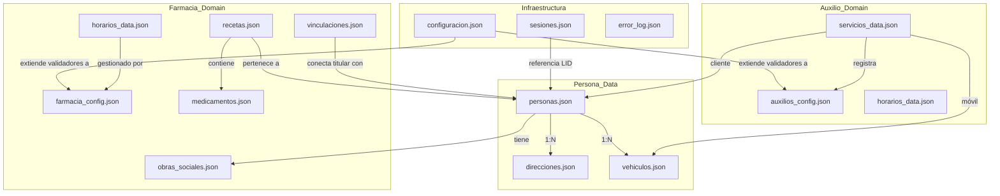

# DOCUMENTACIÓN - AgentIA

## 🚀 Arquitectura General

AgentIA es un bot de WhatsApp diseñado como un sistema **SaaS (Software as a Service) multi-cliente**, modular y escalable. Su arquitectura está orientada a objetos y es 100% dinámica mediante configuraciones en formato JSON.

### Stack Tecnológico
- **Backend:** Python 3.12 con Flask (puerto 5000).
- **Gateway de WhatsApp:** Node.js con WPPConnect (puerto 3000).
- **Persistencia de Datos:** Archivos JSON organizados por inquilino (tenant).
- **Integraciones:** Google Maps API (direcciones) y Google Drive API (almacenamiento de imágenes).

### Estructura Multi-Inquilino (Multi-tenant)
El sistema utiliza una estructura de carpetas `data/{tenant_id}/` para separar los datos de diferentes clientes. El `tenant_id` activo se define en `data/configuracion.json`.

---

## 📦 Módulos Principales

### 1. Núcleo (Core)
- **`app.py`:** Punto de entrada Flask. Gestiona webhooks de entrada y registro de administradores.
- **`src/menu_principal.py`:** Orquestador principal. Decide qué módulo o submenú debe manejar el comando del usuario basándose en el estado de la sesión.
- **`src/sesiones/`:** Gestiona `sesiones.json`. Mantiene el estado del menú, submenú y variables temporales de flujos activos.
- **`src/tenant.py`:** Provee la lógica para acceder a los archivos de datos correctos según el inquilino activo.

### 2. Módulo de Farmacia (`src/farmacia/`)
Especializado en la gestión de una farmacia:
- **Recetas:** Carga de imágenes, extracción de datos mediante IA (Gemini/OpenAI) y gestión de estados (Pendiente, Lista, Entregada).
- **Beneficiarios:** Registro de personas vinculadas al titular del chat.
- **Obras Sociales:** Gestión de coberturas médicas por beneficiario.
- **Staff:** Submódulo para que administradores gestionen horarios fijos, días de guardia y cierres eventuales.

### 3. Módulo de Auxilios (`src/auxilios/`)
Gestión de servicios de asistencia mecánica (grúas):
- **Servicios:** Registro de viajes, cálculo de tarifas (asfalto vs ripio) y estados del servicio.
- **Vehículos:** Catálogo de vehículos propios y auxiliados.
- **Precios y Recorridos:** Configuración dinámica de costos y rutas frecuentes.

### 4. Gestión de Clientes (`src/cliente/` y `src/registro/`)
- **Personas y Direcciones:** CRUD de datos personales y locaciones geográficas (integrado con Google Maps).
- **Motor de Registro:** Sistema de clases base abstractas para crear formularios multi-paso con validadores dinámicos.

### 5. Servicios de Archivos (`src/file_services/`)
- **Storage:** Soporta almacenamiento local o en la nube (Google Drive).
- **Procesamiento:** Conversión de archivos (PDF a imagen) y gestión de metadatos.

---

## 💬 Flujos de Conversación

El bot utiliza un **Motor de Menús Dinámico** donde las opciones se filtran según el **Rol del Usuario** (`usuario`, `admin`, `supervisor`, `root`).

1. **Bienvenida:** Identifica al usuario por su número (LID) o pushname de WhatsApp.
2. **Navegación:**
   - Comandos de activación (ej: "1", "farmacia").
   - Comandos globales: `salir` (vuelve al menú principal), `cancelar` (vuelve al nivel anterior).
3. **Validación:** Cada entrada en un flujo de registro es validada contra reglas definidas en `configuracion.json` (longitud, formato de fecha, email, etc.).

---

## ⚙️ Configuraciones Importantes

- **`data/configuracion.json`:** Contiene el `tenant_id`, validadores globales y la estructura del Menú Principal.
- **`farmacia_config.json`:** Configuración específica del bot de farmacia (prompts de IA, campos de registro, mensajes de staff).
- **`auxilios_config.json`:** Precios base, tipos de vehículos y configuración de servicios de grúa.

---

## 📊 Diagrama de Relaciones de Datos (JSON)

El siguiente diagrama muestra cómo interactúan los archivos JSON del proyecto. Las flechas indican dependencias de datos o relaciones lógicas.

---

## 🛠 Comandos de Mantenimiento

### Actualizar estructura de carpetas
Si agregas nuevos loaders o módulos, recuerda seguir la convención:
- Lógica de negocio en `src/{modulo}/`.
- Configuración estática en `{modulo}_config.json`.
- Datos operativos en `{modulo}_data.json`.
- Gestores de datos en `{modulo}_manager.py`.
